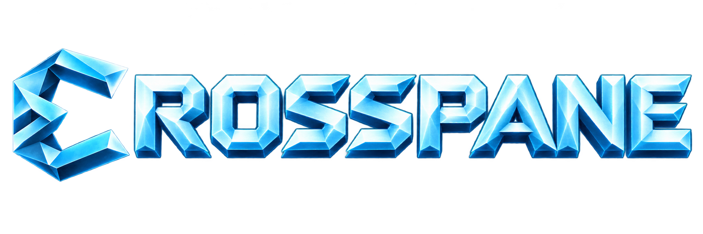

<p align="center">
  
</p>

<p align="center">
  <strong>Your computers. One workspace.</strong><br>
  One keyboard and mouse across your Mac and Linux desktop. Bring individual windows along, too.
</p>

<p align="center">
  <a href="docs/running.md">Get started</a> ·
  <a href="#what-you-can-do">Explore the features</a> ·
  <a href="docs/wp/README.md">Follow development</a> ·
  <a href="https://github.com/frostdev-ops/crosspane/issues">Report an issue</a>
</p>

<p align="center">
  <a href="https://github.com/frostdev-ops/crosspane/actions/workflows/ci.yml"></a>
  
  <a href="LICENSE"></a>
</p>

## Make the whole desk yours

Your Mac has one application. Your Linux desktop has another. Crosspane brings them into the same working space: move your pointer across the edge of a display and keep typing on the next computer, or bring a single application window over to the screen where you want it.

The application keeps running on its own machine. Its projected window appears on the other one, where you can use it with your keyboard and mouse. You keep each computer's applications and environment, while choosing where the work is in front of you.

Crosspane is part of [Frostdev](https://frostdev.io), alongside [Rimeward](https://github.com/frostdev-ops/rimeward) and [Frostsim](https://github.com/frostdev-ops/frostsim).

**Crosspane is in early development.** The current v0 implementation includes shared input, window projection, pairing, a tray / menu-bar control, and a settings app. Start with the [running guide](docs/running.md); the [work-package tracker](docs/wp/README.md) records implementation progress. This repository is ahead of the original Phase 0 introduction, but it is still a developing application.

## What you can do

| | In Crosspane |
| --- | --- |
| **Use one keyboard and mouse** | Arrange your computers' displays on a shared canvas. Cross a touching edge to control the next machine. |
| **Bring a window over** | Show an individual application window from another computer here, or send one of yours there. The application continues running at its source. |
| **Arrange your desk** | Drag machines in the settings app's layout editor, with displays sized in millimetres, and apply the layout. |
| **Choose what a peer may do** | Pair explicitly, then grant or withdraw input, sharing, browsing, and presentation permissions per machine. |
| **Remap your modifiers** | Use per-peer profiles for Ctrl ↔ Command / Super or Alt ↔ Command / Super. |
| **Stay in control** | Take input back from the tray, return a projected window, or stop every session with the panic command. |
| **Use the command line** | Pair, arrange displays, browse windows, project, return, and inspect status with `crosspanectl`. |

### A window, wherever you need it

Pick a window from the other computer using the tray menu, the settings app, or `crosspanectl pick --from <peer>`. The peer must first allow you to browse its windows. You can also send a window from its source with `crosspanectl project <id> <peer>`.

Source-window behavior depends on the platform. Hyprland can park the window on a headless twin output. On macOS, the default is mirroring: the original stays visible. Hiding it requires the opt-in `private-vdisplay` build and configuration, which use the owner-approved `CGVirtualDisplay` private API. See the [running guide](docs/running.md) before enabling that option.

Close the projected window or choose **Return** to give it back. If a connection drops, held keys and buttons are released immediately. The projected window keeps its last picture for a 20-second reconnect grace period, then returns to its source if the connection has not recovered.

### Your machines, paired directly

Crosspane connects peer to peer over IP, including a LAN, direct Ethernet, or USB4 / Thunderbolt networking. Pairing requires comparing a code on the two machines. Connections use QUIC with TLS 1.3 and authenticated peer identities.

Each computer runs its own agent in your user session. The settings app talks to that local agent; the agent handles connections, input, and projection. macOS permissions remain part of setup, and Crosspane respects lock state and Secure Event Input.

## Start with your Mac and Hyprland desktop

| Platform | Current scope |
| --- | --- |
| **Apple Silicon Mac** | macOS 26+ is the MVP target. Requires macOS permissions and a signed agent bundle; see the [Mac setup](docs/setup/mac.md). |
| **Linux / Hyprland** | Current Linux backend. Requires the graphical session, Wayland and system libraries; see [Running Crosspane](docs/running.md). |
| **Windows** | Planned for Phase 3. |
| **GNOME / KDE** | Planned for Phase 4. |

1. **Build and install on both machines.** Follow [Running Crosspane](docs/running.md) for platform dependencies, macOS signing, permissions, and agent startup.
2. **Pair them.** Open the settings app's **Pairing** tab on each machine. Open a pairing window on one, scan and join on the other, compare the code, then confirm.
3. **Arrange the displays.** In **Layout**, place the machines as they sit on your desk and apply. Enable the input permission for shared keyboard and mouse control.
4. **Bring a window along.** Use **Windows** in settings or the tray / menu-bar window picker. Grant browsing on the source when you want to pick its windows from another machine.

A source build of the three applications:

```sh
cargo build --locked --release -p crosspane-agent -p crosspanectl -p crosspane-ui
```

The repository pins Rust in [`rust-toolchain.toml`](rust-toolchain.toml). H.264 motion streaming requires the `video` feature on Linux and FFmpeg 9; without it, projection uses lossless tiles. macOS uses VideoToolbox. Installation and feature-specific builds are covered in the running guide.

### A few useful commands

```sh
crosspanectl status                  # connections, permissions, layout, projections
crosspanectl layout macbook right    # put a paired machine to the right
crosspanectl pick --from macbook     # choose one of its windows to show here
crosspanectl release                 # take keyboard and mouse control back
crosspanectl panic                   # stop all sessions and disarm edge crossing
crosspanectl rearm                   # enable edge crossing again
```

Replace `macbook` with the name of your paired machine.

## Expectations for v0

Crosspane is being built and tested on Mac and Hyprland. Window capture, parking, cursor shapes, and motion streaming have platform-specific limits. The [known limitations](docs/running.md#known-limitations-v0) cover them, including notifications captured with parked windows, Hyprland cursor capture being off by default, and the bandwidth cost of motion without H.264.

The artwork above is branding, rather than an application screenshot. Performance numbers and future roadmap items are goals until their acceptance checks are recorded. For current progress, use the work-package tracker and spike reports.

## Built with Rust

Crosspane separates its OS-independent types, protocol, security, input routing, media, and engine from thin platform adapters. QUIC carries the peer connections; winit and wgpu host projected windows; egui / eframe power the settings app. Native adapters handle macOS and Hyprland permissions, capture, input, and window management.

To work on the project, start with [AGENTS.md](AGENTS.md) and the [workspace design](docs/plan/09-rust-workspace.md). Changes to frozen interfaces and work packages follow the project's scoped implementation rules.

## Documentation

| | Start here |
| --- | --- |
| **Install and use** | [Running Crosspane](docs/running.md) |
| **Prepare a Mac** | [Mac setup](docs/setup/mac.md) |
| **Understand the design** | [Approved plan](docs/plan/README.md) |
| **Follow implementation** | [Work-package tracker](docs/wp/README.md) |
| **Read the experiments** | [Spike reports](docs/spikes/README.md) |
| **Use the brand assets** | [Brand guide and asset inventory](assets/brand/README.md) |

## License

[GPL-3.0-or-later](LICENSE). Distributed versions and modifications carry the same freedoms for their recipients.
