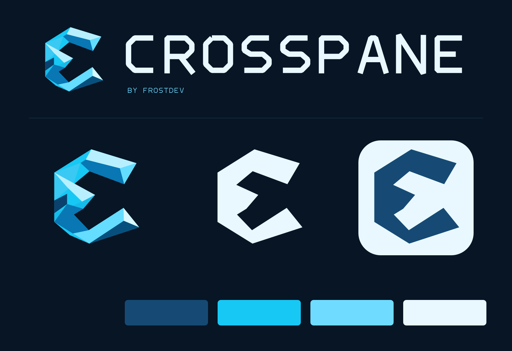

# Crosspane brand

**Your computers. One workspace.**

Crosspane's emblem is a crystalline **crossing-C**: a faceted ribbon that folds through itself, leaving an open passage at its center. The crossing suggests movement between machines without drawing literal monitors or application windows. Its ice-blue facets and angular wordmark place it alongside Frostdev, Rimeward, and Frostsim, while the folded silhouette gives it its own identity.



## Choose an asset

| Use | Asset |
| --- | --- |
| Sculptural banner logo | [Transparent PNG](crosspane-banner-logo.png) — emblem serves as the opening C |
| Main logo on dark backgrounds | [Dark lockup SVG](crosspane-lockup-dark.svg) / [PNG](crosspane-lockup-dark.png) |
| Main logo on light backgrounds | [Light lockup SVG](crosspane-lockup-light.svg) / [PNG](crosspane-lockup-light.png) |
| Single-color logo | [White lockup SVG](crosspane-lockup-mono.svg) / [PNG](crosspane-lockup-mono.png) |
| Wordmark alone | `crosspane-wordmark-{dark,light,mono}.svg` |
| Scalable emblem | `crosspane-mark-{color,white,navy,black}.svg` and 1024px PNGs |
| Sculptural emblem | [Transparent generated master](crosspane-emblem.png) |
| Application icon | [SVG](crosspane-icon.svg), PNGs at 16, 24, 32, 48, 64, 128, 180, 256, 512 and 1024px |
| macOS / Windows icon containers | [ICNS](crosspane.icns) / [ICO](crosspane.ico) |
| Tray / menu-bar symbol | `crosspane-tray-{white,navy,black}.svg`; pick the monochrome variant with contrast against the panel |
| Browser / touch icon | [32px favicon](favicon.png) / [180px touch icon](apple-touch-icon.png) |
| Repository social card | [1280 × 640 PNG](crosspane-social.png) / [SVG](crosspane-social.svg) |
| Wide project banner | [1600 × 560 PNG](crosspane-banner.png) / [SVG](crosspane-banner.svg) |
| README hero | [JPEG](crosspane-hero.jpg) / [WebP](crosspane-hero.webp) |
| Wallpaper / artwork master | [Native-resolution PNG](crosspane-wallpaper.png) |
| Review the identity | [Identity sheet](identity-sheet.png) / [Asset gallery](gallery.html) |

The generated emblem and arctic artwork are expressive campaign assets. The hand-authored vector emblem is a simplified companion for crisp reproduction and small sizes, rather than an exact vector trace of every rendered facet. Wordmarks are paths and require no installed font. The banner's secondary caption uses the renderer's sans-serif font; its PNG export is fixed.

These assets are ready for application and packaging integration. This branding task does not alter the current Rust application or installer wiring. The ICNS and ICO files are export containers, not claims of support for additional platforms.

## Palette

| Color | Hex | Role |
| --- | --- | --- |
| Midnight | `#071525` | Backgrounds and dark surfaces |
| Arctic navy | `#164a74` | Light-background logos, structure, depth |
| Frost cyan | `#17c8f4` | Primary accent |
| Glacier | `#6fdcff` | Highlights and secondary accents |
| Ice white | `#e9f8ff` | Dark-background lettering and monochrome logos |
| Quiet cyan | `#89cbd5` | Supporting copy and badges |

Use the color emblem on midnight or neutral light surfaces. Use a monochrome emblem where dimensional facets would be distracting. Keep clear space of at least one quarter of the emblem's width around standalone marks. Display a full lockup at 280px wide or larger; use the emblem at smaller sizes. At 16–24px, prefer monochrome for panels and the application icon for launchers.

Keep the mark's proportions, open center, and crossing intact. Avoid rotating it, enclosing it in a snowflake, stretching the wordmark, or using pale facets directly on an uncontrasted white surface. The dark and light lockups are deliberately separate.

## Voice

Lead with what someone can do: move the pointer, bring a window over, arrange the desk, take control back. Use **Crosspane** in prose and the custom uppercase wordmark in visual assets. Use **by Frostdev** as the endorsement. The primary tagline is **Your computers. One workspace.**

Show the real application's capabilities and limitations. Identify brand artwork as artwork. Keep planned platforms and performance goals separate from implemented, verified behavior.

## Rebuild and provenance

Run from any directory:

```sh
python /path/to/Crosspane/assets/brand/build_assets.py
```

The exporter uses Python, Pillow, and `rsvg-convert`, already available in the authoring environment. It introduces no application dependencies. It regenerates the vectors, icons, containers, promotional layouts, and optimized artwork exports, while preserving the generated masters. Files are distributed under the repository's [GPL-3.0-or-later license](../../LICENSE).

The sculptural emblem and arctic artwork were created with the built-in image generation tool. No Blender render was needed. Exact prompts are recorded in [generation-prompts.json](generation-prompts.json). The identity system and path-based wordmark were authored locally. Visual references were the [Rimeward lockup](https://github.com/frostdev-ops/rimeward/blob/main/assets/rimeward-lockup.svg) and [Frostsim logo](https://github.com/frostdev-ops/frostsim/blob/main/public/brand/frostsim-logo-web.png), inspected through the repository API. No reference artwork is redistributed in this asset set.
